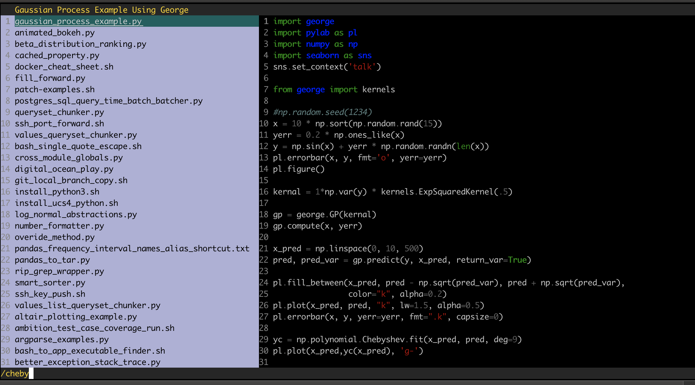
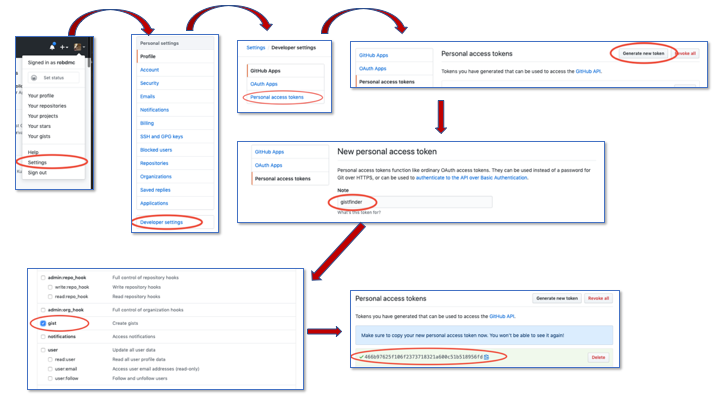

# Gistfinder
Gistfinder provides local terminal-based access to all your github gists.
You can fuzzy-search your gists and have them immediately available to you
for cut and paste into the terminal.

If you are familiar with the vim keybindings (j-k for down-up and / for search) you should feel
right at home in gistfinder.

Here is a gif demo<sup>* (see below for how this gif was created)</sup>


```
bash> gistfinder --help
Usage: gistfinder [OPTIONS]

  A CLI tool for searching your gists

Options:
  -u, --user TEXT   Set up github user
  -t, --token TEXT  Set up github token
  -s, --sync        Sync updated gists
  -r, --reset       Delete and resync all gists
  --help            Show this message and exit.
```

# Installation
```bash
pip install gistfinder
```

# Usage
You must first configure github to allow it access to your github account.
Doing so will store your github username and access token locally to
` ~/.config/gistfinder/github_auth.json`.  (See below for details)

## Sync your gists locally
To sync all your gists locally, simply run
```bash
gistfinder --sync
```
or use the shortcut alias
```bash
gf --sync
```
To blow away all local gists and resync
```bash
gf --reset
```

## Browse and search your gists
To start gistfinder, simply type
```
gistfinder
```
or
```
gf
```
This will open an interactive application in your terminal that looks like this


The yellow text at the upper left is the description of the gist currently
selected in the grey area.  You can navigate this selection using vim-like j-k keys.

At any point you can press the space bar to move over to the code window and navigate your
code using vim keybindings.

To exit gistfinder at any time, you can use either `ctrl-c` or `ctrl-q`, whatever alignes better with your
muscle memory.

Much like vim, pressing the / key will drop you into a fuzzy search across all
your gists.  File names, descriptions and code contents are all indexed in the search.
As you search the file name list on the left will reorder itself to show the most
relevant file names at the top.  Pressing enter will get you out of search mode
and back into list navigation mode, but will continue to show search term that resulted
in the current list ordering.  When you have selected the filename of the gist you are
interested in, simply pressing `enter` will exit gistfinder with the contents of that gist
written to stdout.

**Note: Currently gistfinder is hard-coded to ignore anything with a `.ipynb` extension.
Jupyter notebooks don't play well with gistfinder, so I made sure they are not accessible.**


# Configuration
Gistfinder will need permission from Github to access your gists.
The best way to set this up is to create a personal access token that
gistfinder can use to download your gists to your computer.

Here are the steps:

1. Choose "Settings" from your profile at the upper right corner of your Github home page.
1. Go to "Developer Settings"
1. Choose "Personal access tokens"
1. Generate a new token
1. Name the token something descriptive. Perhaps "gistfinder"
1. Limit the permissions to only have access to gist
1. Copy the created token to your terminal into the command
   ```bash
   gistfinder -u github_username -t your_personal_access_token
   ```

The diagram below illustrates with screen-grabs the steps you need to take on the github site.



And that's it!  You should now be ready to sync and search your gists

# A peak under the hood
All files related to gistfinder are stored on your local machine in the directory
`~/.config/gistfinder`.  Your github username and access token are in `ls ~/.config/gistfinder/github_auth.json` and your gists
are locally synced to the sqlite file `ls ~/.config/gistfinder/database.sqlite`.

Should you want to poke around in the database to see what it contains, **I highly recommend the [visidata](https://www.visidata.org/docs/) tool by Saul Pwanson.**  Visidata is probably the best tool I know of for quickly exploring tabular data contained in databases, csv-files, web-links, and more.

# Additional Info

<sup>*</sup>Just for my future reference, I made this recording by using the native OSX
screen recording feature to make a `.mov` file.  I then used
[Gif Brewary 3](https://apps.apple.com/us/app/gif-brewery-3-by-gfycat/id1081413713?mt=12)
to convert it to a `.gif` file by manually setting the speed to 150%  and
frames-per-sec to 6.  I let the software figure it out from there.

___
Projects by [robdmc](https://www.linkedin.com/in/robdecarvalho).
* [Pandashells](https://github.com/robdmc/pandashells) Pandas at the bash command line
* [Consecution](https://github.com/robdmc/consecution) Pipeline abstraction for Python
* [Behold](https://github.com/robdmc/behold) Helping debug large Python projects
* [Crontabs](https://github.com/robdmc/crontabs) Simple scheduling library for Python scripts
* [Switchenv](https://github.com/robdmc/switchenv) Manager for bash environments
* [Gistfinder](https://github.com/robdmc/gistfinder) Fuzzie-search your gists


